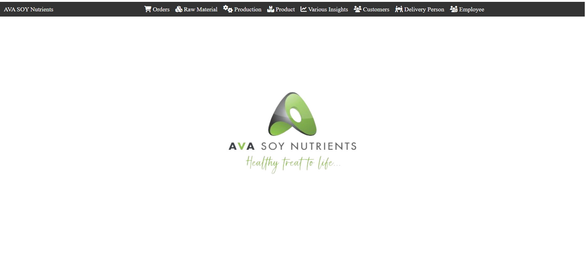
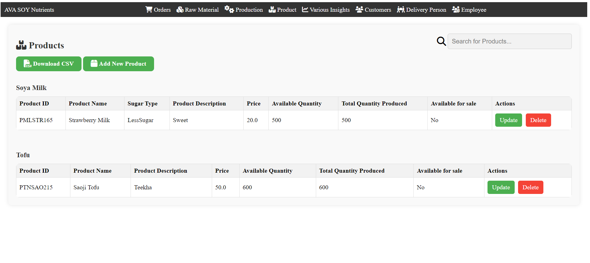
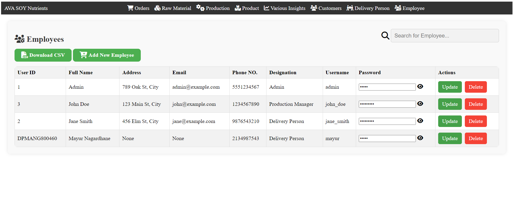
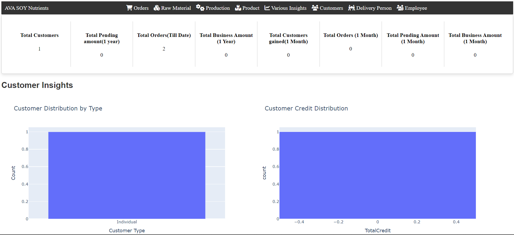
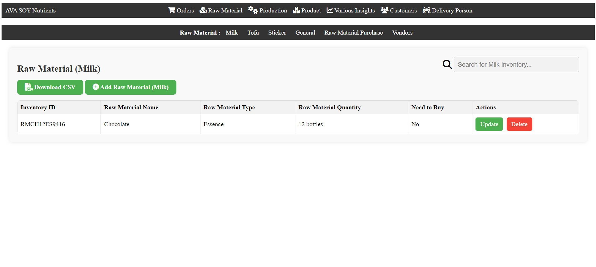

# Inventory Management System

## Overview

This application is designed to manage various aspects of a business including inventory, customers, products, production, orders, delivery, and employees. It features an interface tailored for employees, granting them access only to the functions they need. 








The system is built with the following technologies:
- **HTML**
- **CSS**
- **JavaScript**
- **Python**
- **Flask**
- **SQLite**
- **Jinja2**

## Features

- Efficient customer management
- Comprehensive inventory tracking
- Order processing with alerts for low inventory levels
- Production monitoring with automatic updates
- Actionable insights for optimized inventory levels and improved decision-making

## Getting Started

Follow these steps to set up and run the application.

### Prerequisites

Make sure you have the following installed on your system:
- Python (3.6+)

### Installation

1. **Clone the repository:**

2. **Install the required packages:**
   ```bash
   pip install -r requirements.txt
   ```

3. **Set up the database:**
   ```bash
   python database.py
   ```

   This will create the necessary database tables and a default admin user with the following credentials:
   - Username: `admin`
   - Password: `admin`
   
   You can change the admin credentials after logging in for the first time.

4. **Run the application:**
   ```bash
   python app.py
   ```

5. **Access the application:**

   Open your web browser and navigate to `http://127.0.0.1:5000`.

## Usage

Once the application is running, you can log in with the default admin credentials. From there, you can manage inventory, customers, products, orders, deliveries, and employees. The interface will provide you with the necessary tools to monitor and manage all aspects of your business operations efficiently.

## Contributing

Contributions are welcome! Please fork the repository and submit a pull request for review.